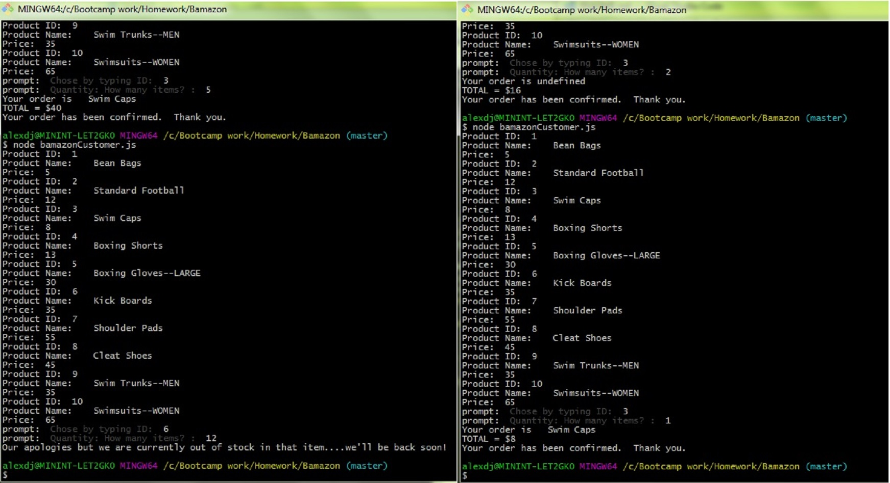

# BAMAZON STORE FOR YOU!!!

## GREAT PRICES, GREAT STOCK

Welcome to the Bamazon Store front.

To use this application, make sure type the following to install these dependcies on your box.

   > npm install mysql prompt 

To run the program, type the following 

   > node bamazonCustomer.js

# HAPPY SHOPPING AND DON'T FORGET TO VISIT US AGAIN!

INSTRUCTIONS FOR ORDERING:

   * Enter the ID of the product you would like to buy.
   * Enter how many units of the product you would like to buy.

_________________________________________________________________

# What Went Into the App....and What's Next

Bamazon was constructed with Javascript, incorporating Express and Node.js on the backend, and MySQL for the Database requirement.

Features I'd like to see implemenmted in future releases:

   * A snazzy front end with CSS
   * Additional views for a MANAGER level
   * MANAGER level will incorporate the following capabilities:
      -View Products for Sale
      -View Low Inventory
      -Add to Inventory
      -Add New Products
    * Images of products
